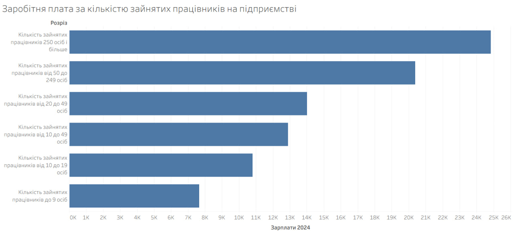
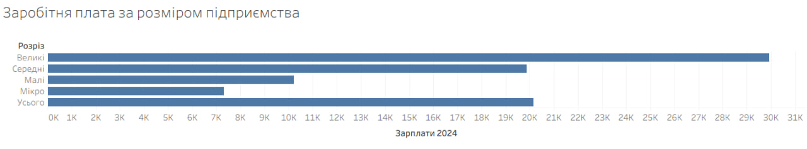
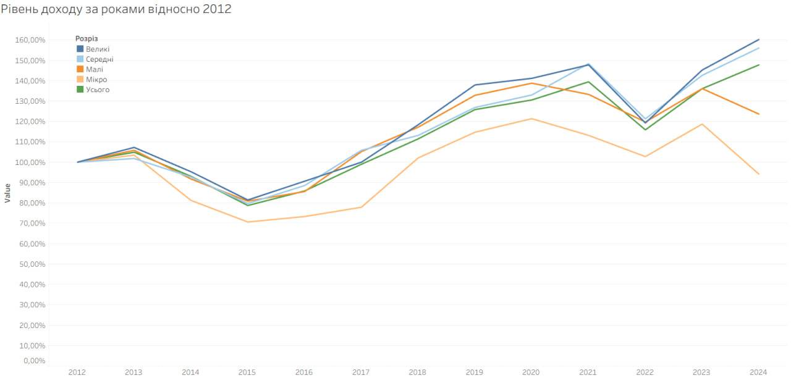

# Аналіз показників діяльності підприємств України (2012–2024)

Цей аналіз базується на офіційних статистичних даних щодо нарахування заробітної плати працівникам у період з 2012 по 2024 рік. 

**Мета дослідження:**
* Визначення залежності між рівнем заробітної плати та розміром підприємства.
* Аналіз впливу кількості працівників на рівень оплати праці.
* Порівняння реального рівня доходів за різні роки з урахуванням кумулятивної інфляції.

---

## 1. Порівняльний аналіз за 2024 рік

### Залежність від кількості працівників
Аналіз демонструє пряму кореляцію між кількістю персоналу та рівнем оплати праці. Підприємства з великим штатом мають стабільнішу фінансову базу для виплати вищих заробітних плат.

*Рис 1. Порівняння зарплат за кількістю зайнятих працівників*

### Залежність від розміру підприємства
Розмір підприємства є ключовим фактором рівня доходу. Спостерігається значний розрив між різними сегментами бізнесу.

На мікропідприємствах середня зарплата у 2024 році складала **7 317 грн**, тоді як на великих підприємствах вона сягала **29 930 грн**, що у 4 рази більше.

---

## 2. Динаміка реального доходу (2012–2024)

Для об'єктивного порівняння доходів за 12 років дані були скореговані на кумулятивний індекс інфляції. За базисний рівень (100%) прийнято показники 2012 року. Це дозволяє побачити зміну купівельної спроможності.

* Згідно з візуалізацією, найсуттєвіше зниження реальних доходів відбулося у **2014–2016 роках** (початок АТО та девальвація) та у **2022 році** (повномасштабне вторгнення рф).
* Найповільніше зростання та найбільш критичне падіння доходів характерне для **мікропідприємств**. Вони виявилися найменш захищеними від економічних потрясінь.
* Попри військові дії та інфляцію, великий та середній бізнес демонструє здатність до поступового відновлення реального рівня оплати праці.

---

[Посилання на Дашборд]([https://docs.google.com/spreadsheets/d/1S5k66p1SXg7G3MkxZ2duY0RmmqxmVSvG7H5FLaxzx1M/edit?usp=sharing](https://public.tableau.com/app/profile/andrii.klymchuk4725/viz/st_17776271767180/Dashboard1?publish=yes))
